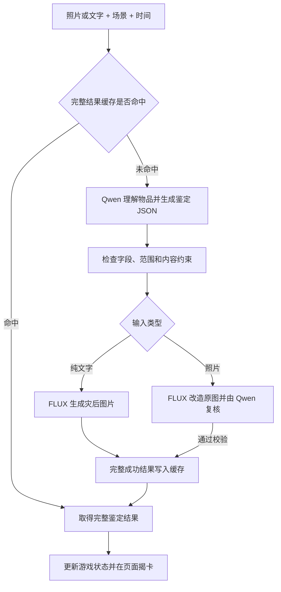

# 《末日物资鉴定局》项目讲解提纲

适用场景：项目介绍、功能演示、技术交流。建议时长：10–12 分钟。

讲解主线：现实物品 → AI 鉴定 → 灾后形态 → 生存决策 → 数据积累与复用。

以下按当前本地项目实现整理。文末附演示顺序和常见问题，可直接作为讲解备忘。

## 1. 开场：这个项目是什么（约 45 秒）

**先说一句话：**

> 我做的项目叫《末日物资鉴定局》。玩家可以拍摄身边的一件物品，或者输入物品名称，系统会判断它在指定灾难和时间之后的形态、用途与价值，再把它加入一个轻量的生存游戏。

讲清三个关键词：

- **现实输入**：现实中的水瓶、鼠标、背包，都可以成为游戏素材。
- **末日翻译**：重新解释物品在末日环境中的身份、用途、风险和价值。
- **生存选择**：鉴定之后，玩家决定使用、储存、出售还是放弃。

开场例子：同一个水瓶，在日常生活中是普通容器；进入废土环境后，它的储水能力、污染风险和交换价值就成了需要权衡的因素。具体鉴定由系统生成，演示时以实际结果为准。

## 2. 产品为什么这样设计（约 1 分钟）

这一部分回答“为什么要做”，暂时不用讲技术名词。

- 让玩家从身边的物品开始，输入门槛低，也容易产生代入感。
- 通过 BEFORE / AFTER 对照，让灾难与时间的影响直接可见。
- 把生成结果接入背包、交易与生存状态，让每次鉴定都有后续用途。
- 用简化规则控制学习成本：只有鉴定和休息推进一天，其余操作不推进时间。

**可以这样讲：**

> 设计重点是让一次 AI 生成形成后续选择。玩家看到结果以后，还要考虑：这件东西值不值得占一个背包格子？该留着自己用，还是卖掉换水？

## 3. 从页面走一遍完整体验（约 2 分钟）

按用户实际操作的顺序展示：

1. **选择存档**：每个角色有自己的生存状态、背包和记录，可自定义名字、切换、重开或删除。
2. **输入物品**：支持上传照片，也支持只填写物品描述。
3. **选择环境**：指定末日场景与经历的时间，例如“城市断电 + 3 年”。
4. **点击鉴定**：出现封存卡牌蓄光、封印散开、翻卡揭晓的动画。
5. **查看结果**：展示灾后图片、末日译名、S–F 评级、六维评分、隐藏用途和处置建议。
6. **作出选择**：立即使用、放入背包、出售或者放弃。
7. **观察代价**：鉴定推进一天，状态发生变化，页面提前显示下一天的毒气伤害。

补充说明：文字输入没有真实原图，因此 BEFORE 保持为空；照片输入才展示真实的前后对照。

## 4. 技术架构：各部分分别做什么（约 1 分钟）

| 部分 | 当前技术 | 负责的工作 |
| --- | --- | --- |
| 页面与交互 | Gradio、HTML、CSS、JavaScript | 输入、结果卡、背包、市场、存档界面及动画 |
| 业务流程 | Python | 串联缓存查询、模型调用、结果校验和状态更新 |
| 物品理解与鉴定 | Ollama 运行 Qwen3-VL 8B | 理解图文输入，输出鉴定数据，并复核照片改造结果 |
| 灾后图片 | ComfyUI 运行 FLUX.2 Klein 4B distilled FP8 | 文字生成图片、根据原照片生成灾后形态 |
| 数据与文件 | SQLite + 本地图片文件 | 保存存档、市场目录、完整结果缓存和预生成进度 |

准确模型名称：`qwen3-vl:8b-instruct-q8_0`。图像模型当前实际部署的是 **4B** 版本。

**可以这样讲：**

> 我把页面、游戏规则和模型调用分开了。模型负责生成鉴定内容，游戏程序负责执行时间、背包和交易规则。将来换模型时，可以保留大部分游戏和页面逻辑。

## 5. 一次鉴定在后台怎样完成（约 1 分 45 秒）

讲解下面这条流程即可，不需要逐个解释函数：

重点讲四件事：

- **结构化输出**：要求模型返回固定结构的数据，例如名称、评级、六维评分、用途和风险，使用 Pydantic 检查格式及数值范围。
- **两种图片流程**：纯文字使用文生图；有照片时使用图像编辑流程，优先保持物品轮廓、关键部件和视角，并增强灾后风化。
- **照片结果复核**：再次比较原图与生成图，检查是否仍为同一物品，以及灾后变化是否足够明显。不合格时有限次重试。
- **失败边界**：如果鉴定卡已完成但图片失败，可以保留鉴定卡、单独补图；补图不重复推进游戏时间。不完整结果不进入完整缓存。

这里的复核是模型辅助检查，不能表述为“百分之百保证图片完全一致”。

## 6. 两个主要工程问题：显存和速度（约 1 分 45 秒）

**问题一：两个模型争用显存。**

本机使用 RTX A5000 24GB。鉴定模型和图像模型需要分阶段运行：先完成一个阶段、释放相应模型，再进入下一阶段。页面鉴定和后台批处理还共用一个跨进程锁，避免同时启动两条耗显存流程。

**可以这样讲：**

> 这里不仅要让两个模型能单独运行，还要控制它们什么时候加载、什么时候释放。显存调度是整个流程稳定运行的一部分。

**问题二：每次都重新生成，等待太久。**

采用完整结果缓存：保存鉴定数据、图片关联和生成版本。相同条件下再次鉴定，直接读取已有结果。

- 文字缓存根据规范化描述、场景、时间和生成版本精确匹配，并支持预设别名。
- 照片缓存额外比较图片内容的哈希，避免同名物品的不同照片误用结果。
- 新物品鉴定完整成功后也会自动入库，供后续复用。
- 图片保存为本地文件；数据库保存路径、哈希等信息，并建立索引。
- 更换关键提示词版本或工作流后，旧结果不会被当作当前版本直接命中。

**预生成情况：**整理了 16 个类别、1000 个常用物品词条，统一预生成“城市断电 + 3 年”。截至 2026-09-05 本次核对，998 项成功、2 项因鉴定名称校验失败待补齐；使用过程中另外产生的成功鉴定也在自动积累。

性能表述：首批本机纯文字生成曾测得约 21 秒/项，完整缓存读取曾测得约 26 毫秒。这是特定测试条件下的结果，不包含页面动画；不同输入和运行状态会影响实际时间。

## 7. 游戏规则怎样接住 AI 结果（约 1 分钟）

讲清“AI 内容”与“游戏结算”的关系：

- 玩家管理生命、体力、饱食度、士气和净水。
- 背包共 6 格，鉴定物资和市场购入物品共享容量。
- 废土市场固定 20 件商品，包含 3 件食物、3 件医疗用品及其他用品、书本、玩具；每轮随机展示 5 件。
- 购买后先进入背包，玩家主动使用时才生效。
- 只有鉴定物资可出售：D–S 级按规则换取净水，E/F 级换取士气；市场购入物品不可转售。
- 市场食物可以补充饱食度；鉴定生成的食物也可少量补充，但超过设定年限会带来生命损失。
- 每日毒气伤害按规则变化，并提前预告。生命归零结束本次生存记录。

**可以这样讲：**

> AI 给出物品的鉴定和评级，程序按固定规则结算它能换多少水、使用后如何影响状态。这样既有生成内容的新鲜感，也有可检查、可调整的游戏规则。

## 8. 视觉与交互为什么这样做（约 45 秒）

- **废土档案风格**：黑金操作界面与纸质鉴定卡共同强化“鉴定局”的设定。
- **图片卡片交互**：背包、市场直接点选图片，便于辨认和选择物品。
- **生存反馈**：生命下降有红色扣血效果，士气累计下降达到阈值时抖动并落尘。
- **揭卡反馈**：鉴定完成时展示本次真实图片与评级，A/S 级有更强光效；支持跳过。

动画只负责展示，不能重复调用鉴定、改变评级或额外推进时间。慢生成、缓存快速返回和鉴定失败分别有对应的动画结束方式。

## 9. 开发过程、当前边界与收尾（约 1 分钟）

按实际迭代脉络介绍：

1. 明确“现实物品转为末日物资”的产品目标，先简化生存规则。
2. 用演示模式打通页面、数据结构和基础操作。
3. 接入本地 Qwen 与 FLUX，处理显存切换和照片改造校验。
4. 补齐文字输入、背包、市场、多角色存档等完整使用流程。
5. 根据使用反馈调整可读性、图片展示和灾后破损表现。
6. 加入自动缓存、常用词预生成和断点续跑，降低重复生成成本。
7. 增加与鉴定结果同步的揭卡特效，并检查成功、失败、跳过等情况。

**当前边界：**

- 当前是本地运行的项目，未建设公网多人账户和云端部署。
- 常用词预生成覆盖固定场景与时间，不能表述为所有组合都已缓存。
- 保存成功鉴定结果的功能已实现，独立的可浏览搜索历史页面尚未实现。
- 仍有 2 个预生成词条待补齐；AI 的评级与图像一致性也仍需持续验证。

后续方向可简短提及：补齐失败词条，扩充有价值的缓存组合，完善历史浏览与质量评估。它们是后续方向，不是本次已经完成的功能。

**收尾参考：**

> 这个项目把现实输入、模型理解、图像生成、数据复用和生存规则接成了一条完整流程。我在实现过程中重点解决了多模型显存调度、生成结果校验和重复请求提速，让玩家能够把身边的物品持续带入游戏。

## 现场演示顺序

1. 进入一个可演示的存档，介绍状态栏与下一天毒气预告。
2. 选一个已缓存的常用物品，在“城市断电 + 3 年”条件下鉴定，快速展示揭卡与鉴定卡。
3. 展示放入背包、点选图片、使用或出售中的一项操作。
4. 展示市场五件商品，演示购买先入背包。
5. 用一张准备好的照片介绍 BEFORE / AFTER 流程；首次生成需要等待，可在等待时讲模型分工与显存调度。
6. 回到缓存，说明相同条件再次鉴定可直接复用结果。

演示注意：鉴定本身会推进一天，即使命中缓存也一样；补图和跳过动画不额外推进时间。截图与事先生成的样例应明确说明来源，不把它们说成现场实时生成。

## 常见问题备答

**这是自己训练的大模型吗？**

没有重新训练基础模型。当前工作主要是本地部署现有模型、设计提示词、约束输出结构、编排生成流程，并把结果接入游戏与数据库。

**Ollama 能直接生成这里的 AFTER 图片吗？**

当前实现中，Ollama 运行 Qwen，负责图文理解和鉴定；AFTER 图片由 ComfyUI 中的 FLUX 工作流生成。

**这个数据库是 RAG 或向量检索吗？**

当前主要是完整结果的精确缓存，配合描述规范化、预设别名和数据库索引，没有接入向量数据库，也没有进行语义近邻检索。

**缓存会不会把不同照片混在一起？**

照片缓存还要匹配规范化图片内容的哈希，并与纯文字缓存区分；物品名称相同不足以命中另一张照片的结果。

**缓存一千条会不会拖慢查询？**

目前使用索引按缓存键查找，数据库规模仍较小。生成所花时间远高于缓存查询；实际读取还包含文件校验、数据解析及页面传输，不能只用一次 SQL 查询时间代表整体响应。

**模型生成了高评级，就能任意增加资源吗？**

评级来自模型输出，但售价由固定代码映射。例如当前 S 级鉴定物资出售得到 15L 净水。实际资源变化仍由游戏程序执行。

**为什么不一次把两个模型都放在显卡里？**

当前本机采用分阶段加载和释放，配合共享锁控制显存使用。这样更符合现有硬件下的稳定运行要求。

**动画会不会让一次鉴定变成两次？**

不会。动画接收鉴定结果信号，只负责展示；相关检查覆盖了缓存快速返回、等待、失败、跳过和部分成功等情况。
